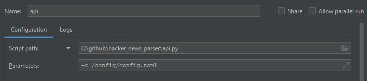
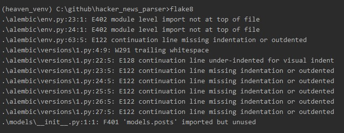

# hacker_news_parser

Приложение, которое периодически парсит главную страницу 
[Hacker News](https://news.ycombinator.com/newest), 
вытягивая из нее список постов и сохраняя в базу данных.

### Описание

API с одним эндпоинтом:

    • /v1/posts - Получение списка новостей из БД

Сервис работает на ``python 3.7``.

Фреймворк для написания API — ``aiohttp``. 

Библиотека для создания простенького REST API ``aiohttp_rest_api``
Документация: [https://aiohttp-rest-api.readthedocs.io/](https://aiohttp-rest-api.readthedocs.io/)

Используемая база данных — ``postgresql``. 

Конфиг приложения находится: [/config/config.toml](config/config.toml)

Тестирование с помощью ``pytest`` и  плагина ``pytest-aiohttp``

## Деплой приложения

Перед деплоем необходимо прописать необходимые параметры в конфиге приложения 
[/config/config.toml](config/config.toml): 
    
1) Ввести хост для подключения к БД - `host = '' # ввести ip локальной машины`. 
Так как БД раскатывается в docker контейнере
        
2) Задержка в секундах, с которой приложение будет опрашивать данные (парсить) -
`delay = <value>`, по умолчанию стоит 60 секунд

Для автоматического запуска необходимо выполнить команду: `deploy.sh`

Файл [PostmanCollection](hacker_news_parser.postman_collection.json) содержит
примеры запросов на все API, который можно импортнуть в Postman

## Подробнее об методах API
##### v.0.1.0

    • GET http://localhost/v1/posts?order=<name>&sort=<name>&limit=<value>&offset=<value>

    order:
        сортировка значений в определённом столбце, по умолчанию id
    sort:
        сортировка, по умолчанию desc
        asc - по возрастанию
        desc - по убыванию
    limit:
        лимит данных, по умолчанию 5
    offset:
        смещение, по умолчанию 0

### Тестирование

 Тестирование в папке [/test](/test) командой `pytest -v -s --tb=short test_hnp.py`

### База данных

По умолчанию настроена на порт ``7474``. Так же как и при миграции через 
``alembic`` - [sqlalchemy.url](alembic.ini).
    
    Port: 7474
    
    Maintenance database: postgres
    
    Username: postgres
    
    Password: admin
    
Таблица ``Post`` располагается в схеме ``public``

### Локальный запуск приложения

Настрока через PyCharm:

### Flake8

